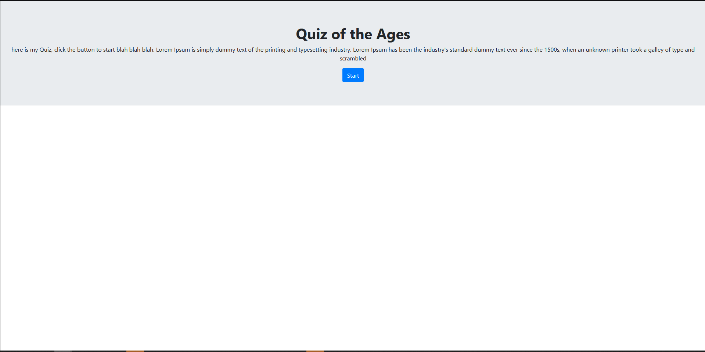

# Web-APIs-Code-Quiz
As requested I have used the provided code and created a Quiz. If you look at the early commit you may see me hit a brick wall and pivoted to finish, which is What I present to you.




[Hosted Website](https://ossaswossas.github.io/Web-APIs-Code-Quiz-/)


## Acceptance Criteria

```
GIVEN I am taking a code quiz
WHEN I click the start button
THEN a timer starts and I am presented with a question
WHEN I answer a question
THEN I am presented with another question
WHEN I answer a question incorrectly
THEN time is subtracted from the clock
WHEN all questions are answered or the timer reaches 0
THEN the game is over
WHEN the game is over
THEN I can save my initials and my score
```